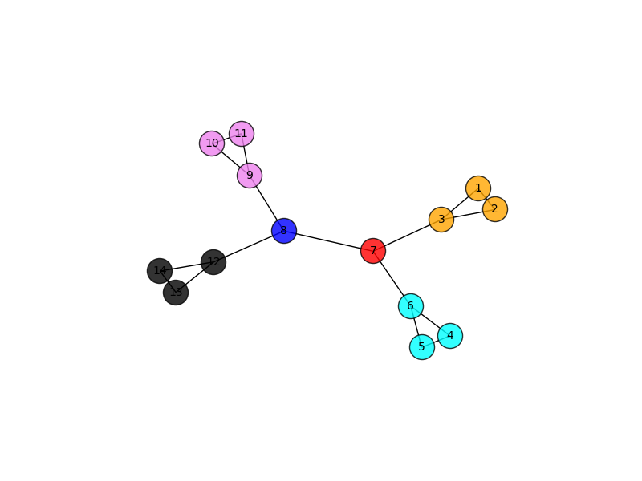

# Community Detection
 This project implements a community detection algorithm using divisive hierarchical clustering ([Girvan-Newman algorithm!](https://en.wikipedia.org/wiki/Girvan%E2%80%93Newman_algorithm)). 
 
 It makes use of 2 python libraries called `networkx` and `community`. The project uses betweenness function and the modularity function which are a part of the networkx and the community libraries respectively. It also uses the matplotlib library for plotting the communities.

# Execution Details
The python code takes two parameters, namely input file containing the graph and the output image with the community structure. 

For example:
	
`python detect_community.py input.txt image.png`

#Input Parameters:
`input.txt`: This file consists of the representation of the graph. All graphs  will be undirected graphs. Each line in the input file is of the format: 
1 2 where 1 and 2 are the nodes and each line represents an edge between the two
nodes. The nodes are separated by one space.

`image.png`: This will be a visualization of the communities detected by this algorithm. Each community is represented in a unique color. Each node  contains a label representing the node numbers in the input file. 

#Output:
The Python code outputs the communities in the form of arrays	
to standard output (the console). Each community is an array representing 
nodes in that community. 

For example:

[1,2,3]

[4,5,6]

[7]

[8]

[9,10,11]

[12,13,14]

These 6 arrays represent the 6 communities in the input graph. 

Also, the community graph will be stored in output file.

Sample graph for above community:

